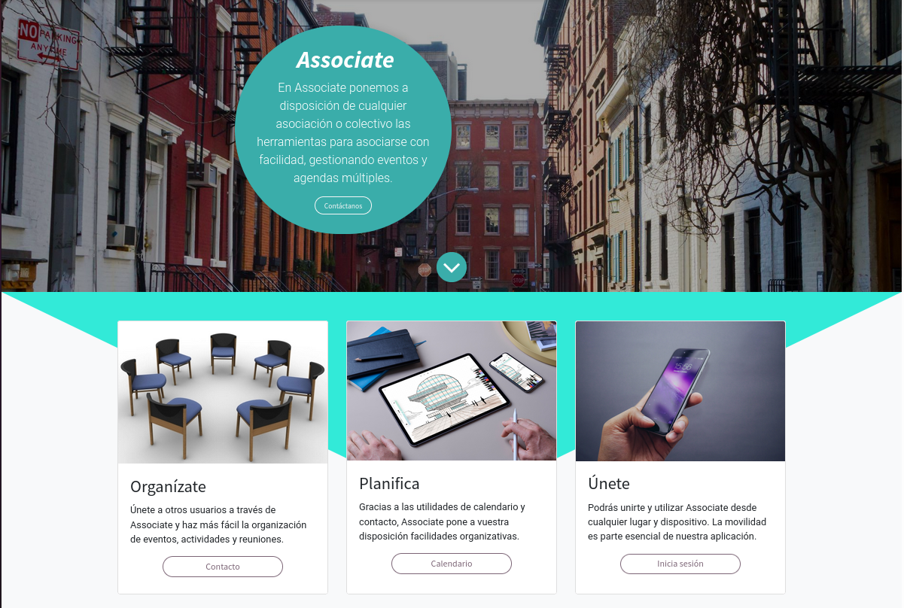
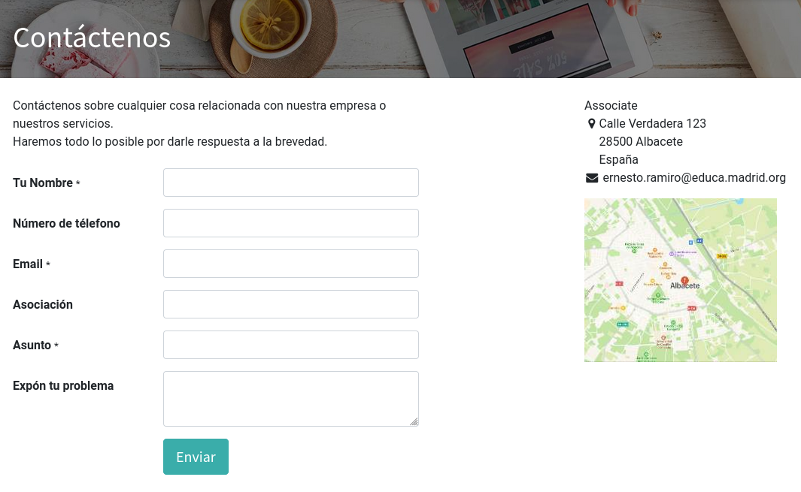
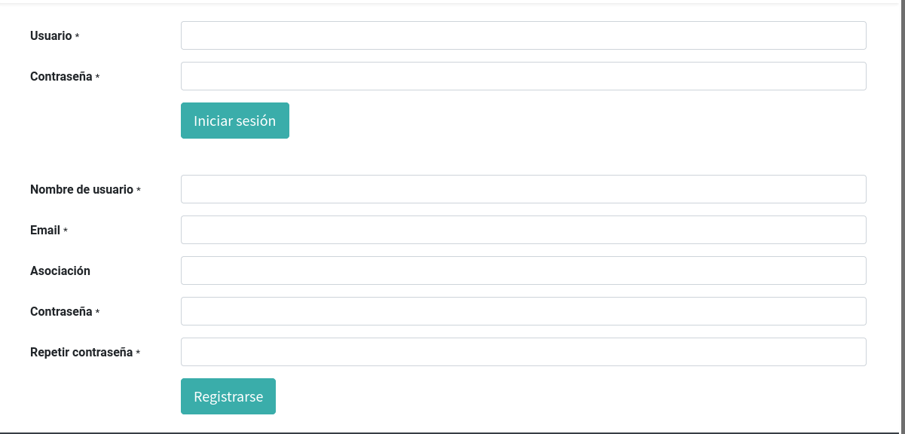
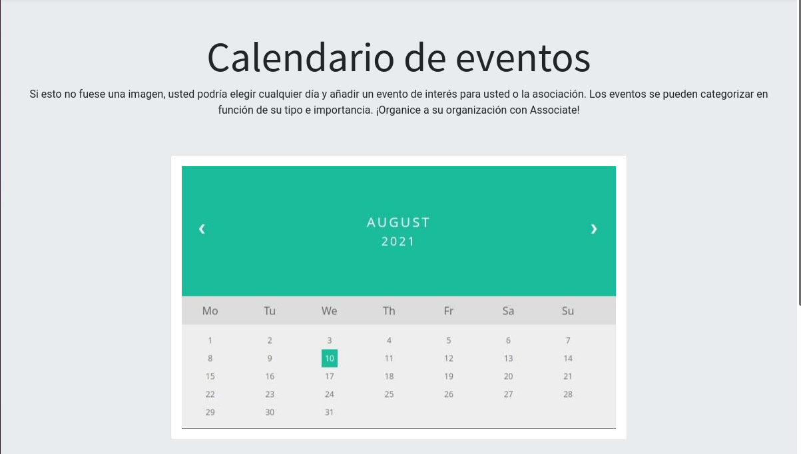

# SGE - Servicios de Gestión Empresarial
## Associate - Odoo

### 1. Introducción
Hablar sobre el proyecto, la app, el servicio y por qué una página web. //QUEDA POR REDACTAR

### 2. Primeros pasos
Creamos una base de datos e instalamos los módulos del sitio web y del proyecto (por el momento).
Para crear el sitio web y dotarle de personalización podemos instalar un tema, que es el siguiente paso que vamos a dar.

### 3. Instalar un tema
Para ello, entramos en la base de datos como administradores para tener un menú enriquecido.
Descargamos un tema gratuito desde la web, por ejemplo de "INTRODUCIR WEB".
Nos metemos desde el usuario de Odoo en la línea de comandos y vamos a addons, y comandamos:
sudo unzip ~/Descargas/tema.zip 
    Tener en cuenta que el ~ es como llamar al home del usuario actual
sudo chown odoo:odoo -R tema/
    Le acabamos de dar propiedad a Odoo los permisos sobre el tema de forma recursiva.

Ahora vamos a Aplicaciones > Actualizar lista de aplicaciones.
Vamos al Sitio Web, escogemos un tema y ya aparece nuestro tema, lo escogemos para aplicarlo.
El tema ya está instalado.
En las opciones de edición bajamos y clickamos en switch theme, nos lleva a una página y comprobamos que tenemos nuestro tema nuevo 
en funcionamiento.

### 4. Creación del sitio web
Vamos a crear nuestro sitio web, Associate. Teniendo en cuenta que vamos a ayudar a asociaciones a realizar sus gestiones, vamos a
crear tres apartados en la web y la página de inicio. Desde el inicio podemos acceder a los otros tres.

1.  Un apartado de contacto.
    Para que los usuario se pongan en contacto con nosotros en caso de problemas o dudas. En este apartado hemos creado un formulario para las exposiciones y mensajes, y mostramos la ubicación de nuestra empresa (Albacete) en el lateral.
    
2. Un apartado de registro e inicio de sesión.
    Para que los usuarios puedan acceder a sus eventos y calendarios.
    
3. Un apartado de calendario.
    Donde los usuarios podrán gestionar los eventos a los que están suscritos desde su asociación y organizarse de forma visual.
    

Todos los cambios que estamos realizando en nuestra web a nivel de código (HTML, SCSS y JavaScrypt) están indicados con la siguiente
nomenclatura: **dam2_roma_nombregenérico**. "roma" indica Rodrigo y Mario, los autores de esta práctica, y en caso de encontrarse las etiquetas
*ro* o *ma* separadas, esto indicaría que sólo uno de ellos habría realizado ese avance. No va a ser lo común.

Lo primero ha sido añadir y cambiar la página a través de las funcionalidades de edición que nos proporciona el propio Odoo. Cuando la capacidad 
de personalización nos ha limitado, hemos tocado algunas partes del código.

Los cambios realizados en el código se podrán comprobar a través de un comando grep en la ruta de Odoo, y los hemos acometido fundamentalmente para añadir botones, cambiar su estilo y añadir unas pequeñas funciones en JavaScrypt para redirigir al usuario a los distintos apartados de la web. 

### 5. Definir productos o servicios

### 6. Clonación del proyecto en VSCode
Realizamos un fork y lo introducimos en Visual Studio Code, ubicándolo donde queramos en nuestro sistema de ficheros para editarlo. Vamos a utilizar el sistema markdown para documentar. Este documento es fruto de este apartado. ¿Recursividad?